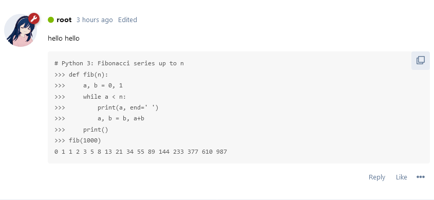

# Copy Code to Clipboard

[](https://github.com/Nearata/flarum-ext-copy-code-to-clipboard/blob/main/UNLICENSE)
[](https://packagist.org/packages/nearata/flarum-ext-copy-code-to-clipboard)
[](https://github.com/Nearata/flarum-ext-copy-code-to-clipboard/blob/main/CHANGELOG.md)

> Adds a copy button to html code tags, allowing users to easily copy the code content.



## Note

This extension works only in secure contexts (https).

## Install

```sh
composer require nearata/flarum-ext-copy-code-to-clipboard
```
